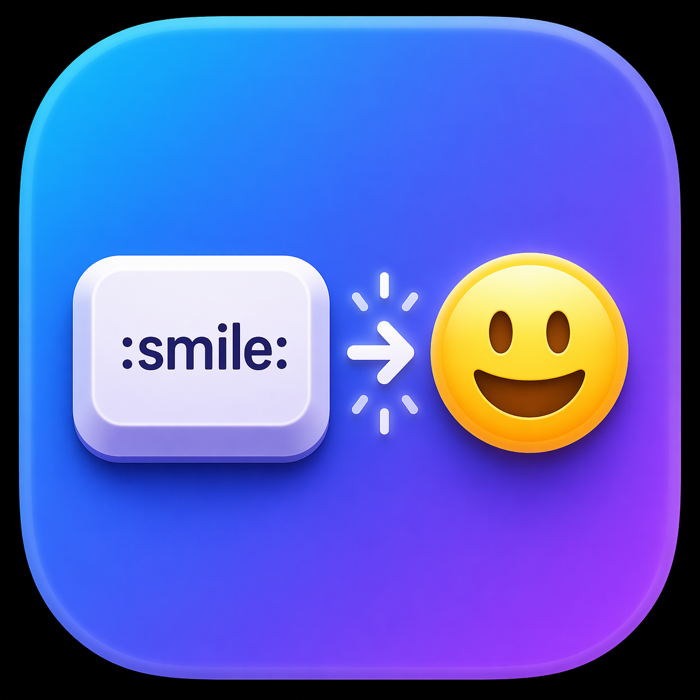

<p align="center">
  
</p>

<h1 align="center">EmojiKeycode</h1>

<p align="center">
  Type <code>:shortcode:</code> in any macOS input field and watch it turn into an emoji.
  <br/>
  Works system-wide. Menu-bar only. No clipboard. No telemetry.
</p>

<p align="center">
  <a href="https://github.com/gadgetfather/emoji-keycode/releases/latest"></a>
  
  <a href="https://github.com/gadgetfather/emoji-keycode/stargazers"></a>
  <a href="https://buymeacoffee.com/gadgetfather"></a>
</p>

---

## What it does

Type `:heart:` in Messages, Mail, Safari, VS Code, Slack, Notes, or anywhere else you can type — and it becomes ❤️ instantly.

- **Auto-replace** — the closing `:` in `:smile:` rewinds the shortcode and types 😄 in its place.
- **Live popup** — while typing `:sm`, a small floating picker shows matching emoji. Use ↑ / ↓ / Enter to pick without finishing the name.
- **Works anywhere** — any text field in any macOS app, native or Electron.
- **Password-safe** — password fields and `sudo` prompts are detected via secure-input mode and bypassed.
- **Clipboard-safe** — never touches your pasteboard. Inserts via synthesized keyboard events.
- **Offline** — 1870 shortcodes from GitHub's [gemoji](https://github.com/github/gemoji) are bundled locally. No network calls ever.

## Requirements

- macOS 13 Ventura or later
- [Xcode](https://developer.apple.com/xcode/) (full install — Command Line Tools alone is not enough, since we need the macOS SDK and XCTest)
- `jq` and `curl` (for generating the emoji database): `brew install jq`

## Install

One-stop build from source:

```sh
git clone <this-repo-url> emoji-keycode
cd emoji-keycode

make emoji-db   # fetch + normalize the gemoji database (first time only)
make app        # compile Swift, assemble EmojiKeycode.app
make run        # launch it (also: open ./EmojiKeycode.app)
```

That produces `EmojiKeycode.app` in the project root. Drag it into `/Applications` if you want to keep it.

### Grant Accessibility permission

On first launch, the Settings window opens and the menu-bar icon shows a red `●`.

1. Click **Open System Settings** in the window (or open **System Settings → Privacy & Security → Accessibility** manually).
2. Toggle **EmojiKeycode** on.
3. The red dot disappears. You're done — no restart required.

This permission is required because EmojiKeycode needs to observe keystrokes system-wide. macOS makes you explicitly grant it; the app cannot bypass this prompt.

### Gatekeeper (unsigned build)

This is an unsigned personal-use build. If macOS blocks it with *"EmojiKeycode.app can't be opened"*, clear the quarantine flag:

```sh
xattr -d com.apple.quarantine ./EmojiKeycode.app
```

Then launch again.

## Use

| Action | How |
|---|---|
| Insert emoji by name | Type `:heart:` → ❤️ |
| Insert emoji by prefix | Type `:sm`, pick from popup, press Enter |
| Cancel the popup | Press Escape, or type any non-shortcode character |
| Commit from popup with Tab | Works the same as Enter |
| Dismiss an unknown shortcode | Just type the closing `:` — nothing happens, colon falls through |

Examples worth trying: `:tada:` → 🎉, `:+1:` → 👍, `:fire:` → 🔥, `:eyes:` → 👀, `:family_man_woman_girl:` → 👨‍👩‍👧 (one glyph, via ZWJ).

## Settings

Accessible from the menu-bar icon → **Settings…**

- **Auto-replace on closing colon** (on by default)
- **Show suggestion popup** (on by default)
- **Launch at login** — registers EmojiKeycode as a login item via `SMAppService`.
- **Accessibility status** — live indicator + shortcut to System Settings.

Both toggles are also available directly in the menu-bar dropdown.

## How it works

```
Key press in any app
  ↓
CGEventTap  — session-wide, head-inserted (can modify/swallow)
  ↓
KeyboardMonitor
  ↓
InputBuffer  — idle ↔ capturing state machine
  ↓
EmojiEngine  — drives popup + replacer
  ↓
Replacer  — synthesizes N backspaces + one unicode keyDown
  ↓
Target app receives the emoji as if you typed it
```

Three macOS primitives do the heavy lifting:

- **`CGEventTap`** — intercepts every keystroke in the session before the target app sees it. Requires Accessibility permission.
- **`CGEvent.keyboardSetUnicodeString`** — injects arbitrary UTF-16, so multi-codepoint emoji (ZWJ families, flags, skin-tone modifiers) insert as one atomic glyph.
- **Accessibility API** (`AXUIElement`) — locates the caret so the suggestion popup anchors below the text you're typing.

The rest is plumbing: a tiny state machine, a JSON lookup, an `NSPanel` for the popup, and a sentinel tag on synthesized events so the tap doesn't feed back on its own output.

## Development

```sh
make build        # swift build -c release
make test         # swift test (23 unit tests)
make emoji-db     # regenerate Sources/EmojiKeycode/Resources/emojis.json
make icon         # regenerate assets/AppIcon.icns from assets/AppIcon.png
make app          # assemble EmojiKeycode.app
make run          # assemble + launch
make clean        # rm -rf .build EmojiKeycode.app
```

Running plain `swift run EmojiKeycode` works for quick iteration but launches the binary without an `.app` bundle — no Dock-hiding, no icon. Use `make run` for anything visual.

### Project layout

```
Sources/EmojiKeycode/
├── main.swift                         # @main entry
├── AppDelegate.swift                  # NSApplication lifecycle, wiring
├── Permissions/PermissionsManager.swift
├── StatusItem/StatusItemController.swift
├── Engine/
│   ├── EmojiEngine.swift              # wires monitor ↔ buffer ↔ replacer ↔ suggestion
│   ├── KeyboardMonitor.swift          # CGEventTap
│   ├── InputBuffer.swift              # state machine
│   ├── Replacer.swift                 # synthesizes keystrokes
│   └── EventTagging.swift             # feedback-loop guard
├── Repository/
│   ├── EmojiRepository.swift          # JSON load, lookup, prefix search
│   └── EmojiEntry.swift
├── Suggestion/
│   ├── SuggestionController.swift
│   ├── SuggestionWindow.swift         # NSPanel
│   ├── SuggestionListView.swift       # SwiftUI list
│   └── CaretLocator.swift             # AX with fallbacks
├── Settings/
│   ├── SettingsWindowController.swift
│   ├── SettingsView.swift             # SwiftUI form
│   └── LaunchAtLogin.swift            # SMAppService wrapper
└── Resources/emojis.json              # bundled gemoji DB
```

## Troubleshooting

- **Menu-bar icon still has a red dot** — Accessibility hasn't been granted (or has been revoked). Open System Settings → Privacy & Security → Accessibility, toggle EmojiKeycode on. No app restart needed; the red dot disappears within 2 seconds.
- **Popup appears in the wrong place in VS Code / Electron / Terminal** — those apps don't expose the text caret via the Accessibility API. The popup falls back to the cursor location. Known limitation.
- **Replacement fires inside a password field** — it shouldn't; macOS sets secure-input mode on password fields and the app bypasses the buffer in that case. If you see this, file an issue.
- **`make emoji-db` says "jq not installed"** — run `brew install jq`.
- **Xcode not found** — `make` defaults to `DEVELOPER_DIR=/Applications/Xcode.app/Contents/Developer`. If your Xcode lives elsewhere, override: `make app DEVELOPER_DIR=/path/to/Xcode.app/Contents/Developer`.

## Privacy

Everything runs locally. Keystrokes pass through the event tap in memory and are discarded — not stored, not logged, not transmitted. No network calls are ever made. The emoji database is bundled at build time.

## Support

If EmojiKeycode saved you a trip to the picker, [buy me a coffee ☕](https://buymeacoffee.com/gadgetfather). Keeps the project alive, no strings attached.

## Credits

- Emoji shortcode set from [github/gemoji](https://github.com/github/gemoji) (MIT).
- Icon art: local asset under `assets/AppIcon.png`.

## License

Personal use. No warranty.
